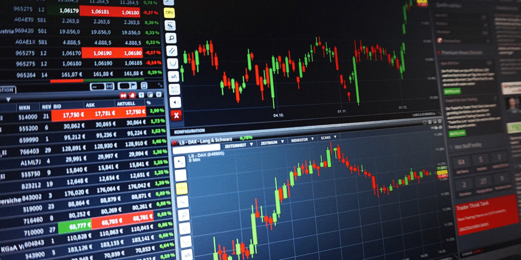
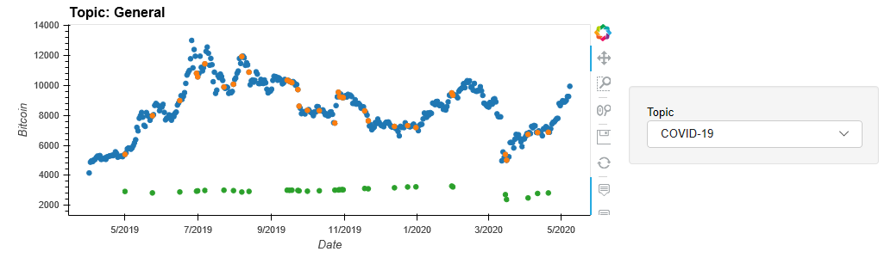

# Fintech_Project

## Crypto, Commodities, & S&P 500 Correlation: A Brief Analysis of 1 year. 



### Background

Portfolio Optimization is used for risk-averse investors to construct portfolios to optimize or maximize expected return based on a given level of market risk, emphasizing that risk is an inherent part of higher reward

Also, with the pandemic (COVID-19) situation, there are uncertainities linked in each sector. So the brief analysis of how crytpo, commodities and S&P 500 markets are performing and how the various news / events affect the prices. 

### Source of Record

* [API for financial data from Yahoo! Finance](https://pypi.org/project/yfinance/)
* [Bloomberg Stock Market](https://www.bloomberg.com/markets/stocks)
* [Twitter News Feed](https://twitter.com/breakingnews?lang=en)
* [Cointelegraph News](https://cointelegraph.com/tags/business)

#### List of Stocks / Tickers

* Crytocurrency - Bitcoin, Bitcoin-Cash & Etherum
* Commodities - Gold & Silver
* Stock - S&P 500

#### Comparision of Prices of all stocks / tickers

* Analysis shows that BTC-USD was the most volatile across the year
* Due to pandemic situation, all the assets show significant drop starting March 2020. 
* Commodities i.e. Gold has grown significantly from around $1300 to $ 1700. But as all other stocks, March 2020 had seen major drop to $1479.




#### Quantitative Analysis

* Performance Analysis


* BTC still has the best returns, while gold is a distant second. Silver and the SP500 track very closely, as do BTCASH and ETH which are near the bottom. 


#### Correlation, Beta & Sharpe Ratio

* Correlation between stocks and other assets class


##### Evaluate Risk

Standard Deviation 
```
Bitcoin_Cash    0.061713
Bitcoin         0.043095
Etherum         0.049667
Gold            0.010216
Silver          0.017035
SP500           0.016209

```

##### Volatility

* Volatility is a statistical measure of the dispersion of returns for a given security or market index. In most cases, the higher the volatility, the riskier the security.

```
Gold            0.162170
SP500           0.257317
Silver          0.270420
Bitcoin         0.684110
Etherum         0.788435
Bitcoin_Cash    0.979665
```
* Bitcoin Cash is the most risky investment followed by Etherum. 
* Gold is at the least risk. 

##### Beta

* High Beta stocks are supposed to be riskier but provide higher return potential
```
Bitcoin_Cash : 0.89
Bitcoin : 0.71
Etherum : 1.01
Gold : 0.01
Silver : -0.06
SP500 : 1.0
```

##### Sharpe Ratio

Sharpe Ratio helps to understand the return of an investment compared to its risk. 

```
Bitcoin_Cash    0.778293
Bitcoin         1.156295
Etherum         0.746208
Gold            1.210387
Silver          0.245059
SP500           0.178116
```


* Bitcoin & Gold have highest return to risk as compared to other assets.

### Portfolio with Static Weights

* Pre-defined weights = [0.1, 0.2, 0.1, 0.2, 0.1, 0.3]

* Statistics :
```
Expected annual return : 35.0%
Annual volatility/standard deviation/risk : 33.0%
Annual variance : 11.0%
```

### Portfolio Optimization: Monte Carlo Simulation

Portfolio Optimization is used for risk-averse investors to construct portfolios to optimize or maximize expected return based on a given level of market risk, emphasizing that risk is an inherent part of higher reward. 

*Single Random Simulation*

* Set our weights to a random numpy array 
```
Random Weights:
[0.01262379 0.25184389 0.2861888  0.04497061 0.32098708 0.43828485]
```
* Rebalance the weights so they add up to one
```
Rebalance
[0.00931715 0.1858765  0.21122519 0.03319112 0.23690849 0.32348156]
```
* Calculate the expected portfolio return
```
Expected Portfolio Return
0.31545060515252904
```
* Calculate the expected portfolio volatility
```
Expected Volatility
0.33310898526588356
```
* Calculate the Sharpe Ratio
```
Sharpe Ratio
0.9469891810355706
```


